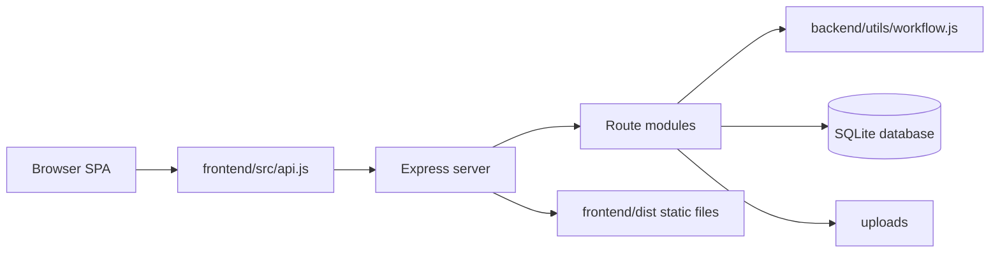

# SIAGA Master Documentation

Tanggal konsolidasi: 2026-05-17

Dokumen ini adalah sumber dokumentasi utama SIAGA. Isinya menggabungkan dan merapikan dokumentasi sebelumnya:

- `docs/multi-cabang-dan-portal-wali.md`
- `docs/implementation-tracker.md`
- `docs/attendance-gate-recovery-plan.md`
- `docs/future-features.md`
- `docs/ui-ux-workflow-logic-audit-report.md`
- `docs/superpowers/plans/2026-05-17-ui-workflow-logic-repairs.md`
- `docs/architecture-map.json` dan `docs/architecture-map.html` sebagai artifact arsitektur

## 1. Ringkasan Produk

SIAGA adalah aplikasi operasional Taruna Prima untuk banyak cabang dalam satu server. Aplikasi ini mencakup manajemen cabang, staff, siswa, enrollment, absensi, gerbang penjemputan, daily record, portal wali, billing, invoice, kuitansi, notifikasi, dan audit log.

Tujuan utama:

- Satu aplikasi dan satu server dipakai semua cabang Taruna Prima.
- Data tiap cabang terisolasi berdasarkan role dan scope.
- Admin pusat dapat melihat dan mengelola seluruh cabang.
- Siswa, guru, dan wali dapat berpindah atau tetap terhubung tanpa kehilangan histori.
- Billing mendukung perbedaan biaya cabang, jenjang, paket, diskon, koreksi, invoice, kuitansi, dan pembayaran parsial.
- Wali murid dapat melihat daily record published dan memberi feedback.

Status umum per 2026-05-17:

- Fitur inti sudah cukup luas dan berjalan.
- Wave 1 audit repair sudah diterapkan untuk role, akses, status, billing, wali history, test workflow, key warning, dan mobile header pressure.
- Gap terbesar yang tersisa ada pada UX safety confirmation, mobile card-first layout yang lebih matang, URL/deep-link state, cleanup mojibake, dan beberapa proteksi lanjutan.

## 2. Stack dan Arsitektur

Ringkasan arsitektur dari architecture map:

- Produk: operational dashboard untuk workflow sekolah/care multi-cabang Taruna Prima.
- Frontend: React 18 SPA, Vite development, Express static hosting untuk production.
- Backend: Express API, JWT auth, better-sqlite3 persistence, upload gambar, role/cabang scoping.
- Database: SQLite, inisialisasi dari `backend/db.js`.
- API module terpasang pada scan awal: 9.
- Endpoint terpasang pada scan awal: 48.
- Frontend API methods pada scan awal: 46.

Catatan: `architecture-map.json/html` dibuat sebelum sebagian repair 2026-05-17. Angka script/API pada artifact lama bisa sedikit berbeda dari kondisi sekarang karena sudah ditambahkan `dev:stable`, `test:workflow`, `waliChildren`, dan regression test.

### 2.1 Topologi



Node utama:

- Browser SPA: `frontend/src/main.jsx`, `frontend/src/App.jsx`, `frontend/src/views/*`.
- API client: `frontend/src/api.js`.
- Express server: `backend/server.js`.
- DB initializer: `backend/db.js`.
- Seed/init: `backend/init.js`.
- Workflow helper: `backend/utils/workflow.js`.

### 2.2 Script Penting

Root scripts:

- `npm run dev`: menjalankan backend watch dan frontend dev.
- `npm run dev:stable`: menjalankan backend tanpa watch dan frontend dev. Gunakan untuk verifikasi/test yang butuh backend stabil.
- `npm run build`: build frontend.
- `npm start`: menjalankan `backend/server.js`.
- `npm run init`: seed/init database.
- `npm run smoke`: smoke test end-to-end.
- `npm test`: API test formal.
- `npm run test:workflow`: regression test workflow audit.

Backend scripts:

- `npm run dev --prefix backend`: `node --watch server.js`.
- `npm run dev:stable --prefix backend`: `node server.js`.
- `npm start --prefix backend`: `node server.js`.

Frontend scripts:

- `npm run dev --prefix frontend`: dev server Vite wrapper.
- `npm run build --prefix frontend`: production build.
- `npm run preview --prefix frontend`: Vite preview.

### 2.3 Environment

Variabel penting:

- `PORT`
- `JWT_SECRET`
- `NODE_ENV`
- `FRONTEND_URL`
- `DB_PATH`
- `ADMIN_PASSWORD`

Aturan production:

- `ADMIN_PASSWORD` wajib diset eksplisit saat `NODE_ENV=production`.
- Admin default tidak boleh mengandalkan fallback development password.

## 3. Domain Sistem

### 3.1 Identity and Access

Tabel: `pengguna`, `staff_profile`, `wali_profile`, `wali_siswa`.

Endpoint utama: `/api/auth` dan `/api/pengguna`.

Catatan:

- Semua login memakai JWT bearer token.
- Scope role dan cabang ditegakkan melalui middleware auth dan helper workflow.
- `pengguna` adalah tabel akun umum untuk staff dan wali.

### 3.2 Master Data

Tabel: `organisasi`, `cabang`, `jenjang`, `rombel`, `guru_rombel`, `operasional_config`, `kalender_event`.

Endpoint: `/api/master`.

Catatan:

- Struktur multi-cabang memakai konfigurasi operasional per cabang, jenjang, dan paket.
- Kalender yayasan global dapat dioverride per cabang.

### 3.3 Student Lifecycle

Tabel: `siswa`, `siswa_enrollment`, `penjemput`.

Endpoint: `/api/siswa`.

Catatan:

- Enrollment menyimpan snapshot cabang, jenjang, rombel, paket, tanggal mulai, tanggal selesai, dan status.
- Histori enrollment tidak boleh hilang saat siswa pindah/lulus/keluar.

### 3.4 Attendance and Pickup

Tabel: `absensi`, `penjemput`, `penjemputan_log`, `early_release`, `tutup_hari`.

Endpoint: `/api/absensi` dan `/api/penjemputan`.

Catatan:

- QR penjemput mengubah status absensi ke `Menunggu`.
- Guru/admin/gerbang dapat memfinalkan `Pulang` sesuai scope setelah repair 2026-05-17.
- `tutup-hari` sekarang mematerialisasi siswa implicit `Belum` menjadi baris `Absen`.

### 3.5 Daily Record and Parent Portal

Tabel: `laporan_harian`, `laporan_attachment`, `laporan_comment`, `laporan_read`, `laporan_edit_log`, `notifikasi`.

Endpoint: `/api/daily-record`, `/api/notifikasi`, `/api/siswa/wali/children`.

Catatan:

- Daily record memiliki status `draft` dan `published`.
- Wali hanya melihat published.
- Wali tetap dapat melihat histori published setelah siswa pindah, keluar, atau lulus.
- Komentar baru tetap dibatasi oleh aturan current enrollment/comment access.

### 3.6 Billing

Tabel: `biaya_tarif`, `diskon_siswa`, `tagihan`, `pembayaran`, `pembayaran_alokasi`, `invoice`, `invoice_item`, `sequence_counter`.

Endpoint: `/api/billing`.

Catatan:

- Tarif dibuat per cabang, tahun ajaran, jenjang, dan jenis biaya.
- Tagihan dibuat manual dengan preview dan idempotent.
- Pembayaran bisa parsial dan dialokasikan ke tagihan.
- Transfer/QRIS dari admin cabang masuk `pending_verification`.
- Payment state machine sudah diperketat pada repair 2026-05-17.

### 3.7 Auditability

Tabel: `audit_log`.

Catatan:

- Audit log global lintas modul.
- Digunakan untuk perubahan akun, role, reset password, cabang staff, wali-siswa, daily record, attachment, billing, payment, invoice, dan workflow penting.
- Audit tidak boleh menyimpan password, password sementara, hash, token, atau credential rahasia.

## 4. Role dan Akses

### 4.1 Role Internal

`admin`

- Admin pusat/yayasan.
- Tidak terikat cabang.
- Dapat mengelola semua cabang dan fitur.
- Frontend: Admin, Kepsek, Guru, Gerbang.

`admin_cabang`

- Operator cabang.
- Terikat satu cabang.
- Mengelola data operasional cabang, staff tertentu, wali cabang, siswa, generate tagihan, input pembayaran.
- Frontend: Admin, Kepsek, Guru, Gerbang.

`kepsek`

- Kepala cabang/sekolah.
- Terikat satu cabang.
- Fokus read-heavy oversight dan laporan.
- Frontend: Kepsek, Guru, Gerbang.

`guru`

- Guru/pengasuh.
- Terikat cabang dan rombel assignment.
- Mengelola absensi, daily record, komentar, pickup sesuai assignment.
- Frontend: Guru, Gerbang.

`gerbang`

- Petugas/akun gerbang.
- Terikat satu cabang.
- Scan QR penjemput dan, setelah repair, dapat finalkan serah-terima `Pulang` dalam scope cabang.
- Frontend: Gerbang.

### 4.2 Role Wali

`wali`

- Akun wali murid/orang tua.
- Scope berdasarkan relasi `wali_siswa`, bukan cabang langsung.
- Melihat daily record published, histori anak, komentar, notifikasi, dan ubah password.
- Frontend: Portal Wali.

### 4.3 Aturan Akun

- Staff login dengan username/password.
- Wali login dengan nomor WhatsApp/password.
- Username staff unik tingkat yayasan.
- Nomor WhatsApp wali unik untuk akun wali.
- Status akun: `undangan`, `aktif`, `nonaktif`.
- Akun `undangan` boleh login tetapi wajib mengganti password.
- `must_change_password` dipakai setelah aktivasi awal dan reset password.
- Password sementara ditampilkan sekali saja melalui modal/tombol salin undangan.
- Staff historis tidak dihapus permanen, gunakan nonaktif.
- Akun wali tetap dapat aktif untuk histori walaupun anak sudah keluar/lulus, kecuali dinonaktifkan manual.

### 4.4 Hak Kelola Akun

- `admin` mengelola semua akun.
- `admin_cabang` membuat/mengedit `guru`, `gerbang`, dan wali yang terhubung siswa aktif di cabangnya.
- `admin_cabang` tidak membuat/mengedit `admin`, `admin_cabang`, atau `kepsek`.
- `kepsek`, `guru`, dan `gerbang` tidak mengelola akun.
- Reset password dilakukan oleh admin yang berwenang.
- Minimal satu admin aktif adalah kebutuhan keamanan. Status tracker saat ini menandai proteksi ini sebagian, perlu penguatan endpoint update.

## 5. Struktur Cabang, Jenjang, Rombel, Paket

### 5.1 Cabang

Cabang awal:

- Godean (`GDN`)
- Kentungan (`KTG`)
- Nitikan (`NTK`)
- Balong (`BLG`)
- Solo (`SLO`)

Keputusan:

- Data dummy awal dianggap milik cabang Godean.
- Kantor pusat yayasan bukan cabang operasional.
- Identitas yayasan dan identitas cabang Godean disimpan terpisah.
- Cabang dapat dinonaktifkan tanpa menghapus data.
- Cabang nonaktif tidak boleh menerima transaksi operasional baru.
- Admin pusat tetap dapat melihat histori dan menerima pembayaran tagihan lama.
- Kode cabang sebaiknya tidak mudah diubah setelah ada transaksi. Ini masih backlog.

### 5.2 Terminologi

Istilah domain yang dipakai:

- `cabang`
- `jenjang`
- `rombel`
- `guru_rombel`
- `pengguna`

Catatan:

- `kelas` lama diganti konsepnya menjadi `rombel` karena rombel adalah kelompok aktual siswa yang dipegang guru.
- `pengguna` lebih netral daripada `guru` atau `staff` karena mencakup staff internal dan wali.

### 5.3 Jenjang dan Rombel

Jenjang/layanan standar:

- `KB A`
- `KB B`
- `TK A`
- `TK B`
- `Child and Baby Care`

Default rombel saat cabang dibuat:

- `KB A`
- `KB B`
- `TK A`
- `TK B`
- `Child and Baby Care`

Cabang dapat menambah rombel paralel, misalnya `KB A 2`.

### 5.4 Paket

Paket siswa:

- `reguler`
- `full_day`
- `care`

Aturan:

- Jenjang sekolah KB/TK dapat `reguler` atau `full_day`.
- `full_day` adalah status per siswa, bukan per rombel.
- `Child and Baby Care` memakai paket penitipan/care.
- Anak sekolah yang lanjut sore memakai paket `full_day`, bukan double enrollment sekolah + care.
- Anak care dapat tetap care beberapa tahun, pindah manual ke KB A, keluar, atau mengikuti sekolah luar. Sekolah luar cukup dicatat pada profil.

## 6. Siswa, Enrollment, dan Histori

### 6.1 Enrollment

Siswa dapat pindah cabang, jenjang, paket, dan rombel dengan tanggal efektif.

Saat pindah, admin memilih:

- Cabang tujuan
- Jenjang/layanan tujuan
- Paket tujuan
- Rombel tujuan
- Tanggal efektif
- Catatan/alasan opsional

Aturan billing terkait pindah:

- Tagihan bulanan mengikuti kondisi siswa pada tanggal 1 bulan tersebut.
- Jika siswa pindah di tengah bulan, bulan berjalan mengikuti kondisi tanggal 1, bulan berikutnya mengikuti kondisi terbaru.

### 6.2 Status Siswa dan Enrollment

Status siswa canonical setelah repair:

- `aktif`
- `keluar`
- `lulus`

Status enrollment canonical:

- `aktif`
- `selesai`

Catatan repair 2026-05-17:

- UI sebelumnya memakai `nonaktif` untuk siswa, padahal schema menerima `aktif`, `keluar`, `lulus`.
- Kenaikan sebelumnya menulis `nonaktif` ke `siswa_enrollment`, padahal schema menerima `aktif`, `selesai`.
- Perbaikan sudah diterapkan dan dilindungi regression test.

### 6.3 Kenaikan Tahun Ajaran

Kenaikan bersifat semi-manual dengan preview:

- `KB A -> KB B`
- `KB B -> TK A`
- `TK A -> TK B`
- `TK B -> lulus`
- `Child and Baby Care -> tetap care` secara default

Hak akses:

- Admin pusat dapat menjalankan untuk semua cabang.
- Admin cabang dapat menjalankan untuk cabangnya sendiri.
- Proses mencatat audit log.

Tahun ajaran global yayasan: Juli sampai Juni.

### 6.4 Snapshot Histori

Data historis tidak boleh berubah makna saat siswa pindah cabang/rombel/paket.

Record historis harus menyimpan snapshot:

- `siswa_id`
- `cabang_id`
- `rombel_id`
- `jenjang_id`
- Paket/program saat kejadian
- Tanggal/periode
- Pengguna pembuat/petugas

Berlaku untuk absensi, daily record, billing, invoice, pembayaran, penjemputan log, dan audit log.

## 7. Operasional, Absensi, dan Gerbang

### 7.1 Konfigurasi Operasional

Konfigurasi per cabang/paket mencakup:

- Jam masuk
- Jam pulang reguler
- Jam pulang full day
- Jam/pola care bila perlu
- Apakah terlambat dihitung
- Apakah kalender sekolah berlaku
- Apakah daily record wajib
- Batas ideal publish daily record
- Aturan pickup fleksibel untuk care

Kalender:

- Kalender yayasan global.
- Override kalender per cabang.
- Masuk khusus/libur khusus per cabang.
- Daily record dan absensi mengikuti gabungan kalender sesuai cabang dan paket.

### 7.2 Core Loop Absensi dan Gerbang

Alur utama:

1. Guru membuka Absensi untuk tanggal dan rombel yang ditugaskan.
2. Guru check-in siswa melalui kartu/list atau NFC siswa.
3. Gerbang scan QR penjemput valid.
4. Siswa menjadi `Menunggu` dan guru terkait menerima notifikasi.
5. Guru/admin/gerbang memastikan serah-terima dan menekan `Pulang`.

Transisi status:

- `Belum` atau `Absen` -> `Hadir`, `Terlambat`, `Izin`, `Sakit`, `Absen`.
- `Hadir` atau `Terlambat` -> `Menunggu`.
- `Menunggu` -> `Pulang`.
- Status aktif/final tidak boleh dioverwrite sembarangan oleh aksi guru normal.

### 7.3 Tutup Hari

Aturan setelah repair:

- Saat `tutup-hari`, backend mengambil semua siswa aktif di cabang/tanggal tersebut.
- Jika belum ada row `absensi`, row dibuat dengan status awal `Belum`.
- Row `Belum` diubah menjadi `Absen`.
- Status lain seperti `Hadir`, `Terlambat`, `Menunggu`, `Pulang`, `Izin`, `Sakit` dipertahankan.
- Tanggal/cabang yang sudah ditutup tidak dapat ditutup ulang.

### 7.4 Izin Pulang Dini

Aturan:

- Hanya `admin` dan `kepsek` yang dapat membuat izin pulang dini.
- Izin bersifat per siswa dan per hari.
- Reason wajib.
- Penjemput tetap harus scan QR aktif di gerbang.
- Guru atau petugas tetap konfirmasi final handoff dengan Pulang/NFC.
- Sistem mencatat pembuat izin, alasan, waktu, penjemput, waktu scan QR, dan waktu handoff.

Implementasi yang direkomendasikan:

- Gunakan tabel `early_release`, bukan status absensi baru.
- `/api/penjemputan/scan` sebelum jam pulang hanya boleh berhasil jika ada early release aktif untuk siswa tersebut pada hari itu.
- Normal pickup restriction tetap berlaku untuk siswa lain.

### 7.5 Future: Dedicated Gate Device / Kiosk

Mode saat ini:

- USB 2D QR scanner sebagai keyboard input pada Pos Gerbang.
- Browser camera scanning sebagai backup tablet/phone jika browser mendukung.

Deployment hardware masa depan:

- Mini PC, Raspberry Pi, atau fixed Windows device di gerbang.
- USB 2D QR scanner sebagai input utama.
- Browser kiosk mode membuka SIAGA Pos Gerbang otomatis.
- Session `gerbang` tersimpan dengan prosedur logout/recovery yang jelas.
- Optional UPS, wired LAN, speaker feedback, dan local health indicator.

Aturan:

- Validasi tetap di backend.
- Device hanya submit QR ke `/api/penjemputan/scan`.
- Route/launch parameter kiosk hanya menyederhanakan UI, bukan bypass role atau pickup rules.
- Tambahkan online/offline indicator sebelum unattended kiosk.

## 8. Daily Record dan Portal Wali

### 8.1 Scope Portal Wali Fase Awal

Termasuk:

- Daily record published
- Feedback/komentar thread
- Notifikasi daily record dan komentar
- Read receipt daily record
- Ubah password wali

Belum termasuk fase awal:

- Tagihan
- Invoice
- Pembayaran
- Kuitansi
- Absensi/check-in/pulang
- Edit profil anak
- Edit penjemput

### 8.2 Akun Wali

Aturan:

- Akun wali dibuat manual oleh admin/admin cabang.
- Dapat dibuat dari data penjemput, tetapi tidak semua penjemput otomatis mendapat akses.
- Satu siswa maksimal memiliki satu akun wali aktif.
- Satu akun wali dapat dikaitkan ke beberapa siswa, misalnya saudara kandung.
- Akun wali melekat ke siswa, bukan cabang.
- Saat siswa pindah cabang, akun wali tetap sama.
- `wali_siswa.relasi` opsional, misalnya Ayah, Ibu, Wali, Lainnya.

### 8.3 Daily Record

Daily Record V2 menghubungkan laporan harian wali dengan perencanaan akademik. Akademik/admin/kepsek menyiapkan `Modul Ajar` mingguan, lalu guru membuat `Focus Theme` harian per rombel dari referensi modul tersebut. Setiap daily record anak memakai Focus Theme sebagai konteks kelas dan tetap menyimpan update care harian serta satu observasi objektif spesifik anak.

Status:

- `draft`
- `published`

Aturan:

- Guru dapat menyimpan draft.
- Wali hanya melihat `published`.
- Guru menekan `Kirim ke Wali` untuk publish.
- Tidak ada unpublish fase awal.
- Setelah published, record tetap editable oleh guru yang punya akses.
- Edit setelah published dicatat audit log.
- Wali melihat versi terbaru.
- Guru memiliki preview tampilan wali sebelum publish.
- Publish V2 membutuhkan Focus Theme untuk rombel/tanggal, mood, makan, tidur, domain observasi, dan catatan observasi anak.

Kewajiban:

- Daily record wajib dibuat dan dikirim untuk siswa aktif yang hadir/beraktivitas pada hari masuk.
- Tidak wajib pada hari libur.
- Tidak wajib untuk siswa Izin/Sakit/Absen.
- Jika siswa check-in lalu pulang dini, daily record tetap wajib.
- Publish terlambat diperbolehkan tetapi tercatat.
- Batas publish ideal konfiguratif per cabang/paket.
- Label telat hanya untuk internal.

Read receipt:

- Saat wali membuka daily record, sistem mencatat `read_at`.
- Notifikasi tidak dibuat hanya karena wali membaca record.
- Jika guru mengedit teks atau attachment setelah publish, record menjadi unread lagi.
- Status terbaca dibandingkan dengan `last_published_change_at`.

Attachment:

- Guru dapat melampirkan foto, tidak wajib.
- Maksimal 5 foto per daily record.
- Foto dikompres otomatis.
- Video tidak didukung fase awal.
- Foto terlihat wali setelah published.
- Foto dapat ditambah/dihapus setelah publish dengan audit log.
- Edit foto setelah publish membuat record unread lagi.

### 8.4 Feedback dan Komentar

Aturan:

- Wali dapat komentar pada daily record published.
- Tidak ada batas waktu komentar selama record masih boleh dikomentari.
- Guru dapat membalas komentar.
- Komunikasi hanya antara guru/pengasuh dan wali.
- Kepsek/admin dapat melihat sesuai scope tetapi tidak membalas.
- Gerbang tidak mengakses komentar daily record.
- Semua guru rombel menerima notifikasi komentar wali.
- Semua guru rombel boleh membalas.
- Read status komentar/notifikasi per pengguna.
- Komentar wali teks saja fase awal.

### 8.5 Histori Portal Wali

Jika siswa lulus/keluar:

- Wali tetap dapat login kecuali akun dinonaktifkan manual.
- Wali dapat melihat histori daily record yang sudah `published`.
- Histori menjadi read-only.
- Wali tidak dapat membuat komentar baru jika aturan current enrollment tidak mengizinkan.
- Komentar lama tetap terlihat.

Jika siswa pindah cabang:

- Wali tetap melihat histori `published` dari cabang lama.
- Daily record cabang lama read-only untuk wali/guru lama.
- Komentar baru hanya boleh pada record terkait cabang/enrollment aktif siswa.
- Guru cabang lama tetap dapat melihat komentar lama secara read-only.
- Admin cabang pemilik record lama dapat koreksi administratif dengan audit log.
- Admin cabang baru tidak mengoreksi record lama milik cabang lain.

Repair 2026-05-17:

- Ditambahkan access path khusus wali berdasarkan `wali_siswa`.
- Ditambahkan `/api/siswa/wali/children`.
- Wali history tidak lagi bergantung pada active enrollment saja.

## 9. Billing dan Keuangan

### 9.1 Scope Biaya

Fase awal mencakup:

- SPP bulanan
- Tambahan full day bulanan
- Biaya penitipan bulanan untuk Child and Baby Care
- Biaya kegiatan tahunan untuk jenjang sekolah

Child and Baby Care:

- Hanya biaya care bulanan.
- Tidak terkena SPP, full day, atau kegiatan tahunan.

### 9.2 Tarif dan Generate Tagihan

Tarif:

- Dibuat per cabang, tahun ajaran, jenjang, jenis biaya/paket.
- Perubahan tarif hanya memengaruhi tagihan baru.
- Tagihan yang sudah dibuat menyimpan nominal final sendiri.
- Tarif hanya dibuat/diubah admin pusat.

Generate tagihan:

- Manual dengan preview, bukan scheduler otomatis fase awal.
- `admin` dapat generate semua cabang.
- `admin_cabang` dapat generate cabangnya sendiri.
- `kepsek` hanya melihat laporan.
- Proses idempotent, tidak membuat tagihan dobel.
- Jika tarif belum lengkap, sistem menampilkan error list. Jangan membuat tagihan Rp0 diam-diam.

Biaya kegiatan tahunan:

- Dibuat melalui generate tahunan dengan preview.
- Siswa masuk tengah tahun mendapat prorata berdasarkan sisa bulan Juli-Juni.
- Bulan masuk dihitung bulan penuh.
- Urutan hitung: tarif dasar -> prorata -> koreksi manual -> diskon/keringanan -> nominal final.

### 9.3 Diskon dan Koreksi

Diskon/keringanan:

- Dapat dibuat admin untuk semua cabang.
- Dapat dibuat admin cabang untuk cabangnya sendiri.
- Kepsek lihat saja.
- Bentuk persen atau nominal tetap.
- Target per jenis biaya.
- Default per siswa per tahun ajaran.

Koreksi tagihan:

- Dilakukan admin/admin cabang untuk tagihan sesuai scope.
- Wajib alasan.
- Harus mencatat before/after, petugas, waktu, dan audit log.

### 9.4 Pembayaran

Aturan:

- Mendukung pembayaran parsial/cicilan.
- `pembayaran` mencatat transaksi uang masuk.
- `pembayaran_alokasi` mencatat alokasi ke tagihan.
- Default alokasi ke tagihan tertua, tetapi admin dapat memilih/mengedit alokasi.
- Metode: tunai, transfer, qris, lainnya.
- Pembayaran tidak dihapus, gunakan void/pembatalan dengan alasan.
- Kuitansi resmi hanya untuk `confirmed`.

Verifikasi:

- Transfer/QRIS admin cabang masuk `pending_verification`.
- Tunai oleh admin cabang langsung `confirmed`.
- Admin pusat verify/reject pending.
- Pending belum membuat tagihan lunas.

Repair 2026-05-17:

- `GET /api/billing/tagihan?siswa_id=` tidak lagi bypass cabang scope.
- Payment creation memvalidasi siswa aktif berada di cabang pembayaran.
- Reject hanya boleh dari pending.
- Allocation edit hanya untuk confirmed atau pending.
- Rejected dan void menjadi terminal untuk allocation edit.
- UI payment action diselaraskan dengan backend state.

### 9.5 Akses Keuangan

- `admin`: semua cabang dan semua aksi.
- `admin_cabang`: cabangnya sendiri, input/edit pembayaran, generate tagihan, koreksi tagihan cabang sendiri.
- `kepsek`: melihat laporan dan detail tunggakan cabang, tanpa input/void.
- `guru` dan `gerbang`: tidak ada akses keuangan.

Siswa pindah cabang:

- Riwayat tagihan/pembayaran cabang lama tetap terlihat pada profil siswa.
- Admin cabang baru boleh melihat riwayat lama sesuai aturan produk, tetapi tidak mengubah/void transaksi lama.
- Pembayaran tagihan cabang lama hanya admin cabang lama atau admin pusat.
- Tidak ada settlement antar cabang fase awal.

### 9.6 Invoice dan Kuitansi PDF

Nomor dokumen:

- Invoice: `INV-{KODECABANG}-{TAHUNAJARAN}-{000001}`.
- Kuitansi: `TP-{KODECABANG}-{TAHUNAJARAN}-{000001}`.

Aturan:

- Nomor dibuat per cabang per tahun ajaran.
- Invoice dibuat on-demand oleh admin.
- Invoice dapat menggabungkan beberapa tagihan selama siswa dan cabang pemilik tagihan sama.
- Invoice tidak boleh lintas cabang.
- Kuitansi hanya untuk pembayaran `confirmed`.
- PDF memakai kop yayasan dan identitas cabang.
- Kop/logo final masih backlog menunggu logo/kop resmi.

## 10. Audit, Waktu, dan Keamanan

### 10.1 Audit Log

Minimal field:

- `actor_pengguna_id`
- `action`
- `entity_type`
- `entity_id`
- `cabang_id` nullable
- `before_json`
- `after_json`
- `reason`
- `created_at`

Action penting:

- Perubahan akun/role.
- Reset password.
- Perubahan cabang staff.
- Relasi wali-siswa.
- Koreksi daily record.
- Perubahan attachment after publish.
- Koreksi billing/tagihan.
- Void payment/tagihan.
- Verify/reject payment pending.
- Kenaikan tahun ajaran.
- Tutup hari.

### 10.2 Waktu

- Timestamp teknis disimpan UTC ISO.
- Tanggal operasional sekolah memakai Asia/Jakarta.
- Tanggal absensi, daily record, dan periode billing dihitung berdasarkan Asia/Jakarta.
- UI menampilkan waktu WIB/Asia Jakarta.

### 10.3 Keamanan

- Audit tidak menyimpan password, password sementara, hash, token, credential.
- Untuk production, `ADMIN_PASSWORD` wajib.
- Admin default wajib ganti password setelah setup.
- Minimal satu admin aktif perlu diproteksi kuat. Status saat ini: sebagian, masih backlog.

## 11. UI/UX dan Workflow Audit 2026-05-17

### 11.1 Metode Audit

Dilakukan pada frontend dan backend untuk login, role navigation, admin operations, daily record, attendance, gate pickup, parent portal, billing, notifications, dan development verification.

Verifikasi audit:

- Review source `frontend/src`, `backend/routes`, `backend/utils`, `scripts`, `docs`.
- Dev stack dan browser inspection pada `http://127.0.0.1:5173`.
- Walkthrough Admin, Kepsek, Guru, Gerbang.
- Mobile viewport 390px.
- `npm test` dan `npm run build`.
- Perbandingan dengan desain multi-cabang dan tracker.

### 11.2 Temuan Prioritas dan Status

P1 Gerbang handoff UI/backend mismatch

- Status: fixed.
- Backend sekarang mengizinkan role `gerbang` pada `/api/penjemputan/pulang` sesuai scope.
- UI copy Gerbang diperjelas.
- Regression test: ada.

P1 Tutup Hari tidak menutup implicit `Belum`

- Status: fixed.
- Backend mematerialisasi row absensi untuk siswa aktif yang belum punya row.
- `Belum` menjadi `Absen` saat tutup hari.
- Regression test: ada.

P1 Billing query bypass by `siswa_id`

- Status: fixed.
- Query tagihan by siswa sekarang memakai scope guard.
- Regression test: ada.

P1 Payment transition under-constrained

- Status: fixed untuk transition utama.
- Reject hanya dari pending.
- Allocation edit hanya untuk confirmed/pending.
- Payment creation validasi ownership cabang.
- Regression test: ada.

P1 Siswa/enrollment status mismatch

- Status: fixed.
- Siswa memakai `aktif`, `keluar`, `lulus`.
- Enrollment memakai `aktif`, `selesai`.
- UI siswa tidak memakai `nonaktif` lagi.
- Regression test: ada.

P1 Wali history after inactive/no active enrollment

- Status: fixed.
- Wali child/history path berbasis `wali_siswa`.
- Published history tetap terbaca setelah siswa tidak aktif.
- Regression test: ada.

P2 Development watcher restarts backend during tests

- Status: fixed/mitigated.
- Ditambahkan `dev:stable` dan catatan test precondition.
- Gunakan backend non-watch untuk test.

P2 High-risk admin actions lack impact-focused confirmation

- Status: open.
- Perlu reusable confirmation modal dengan entity, consequence, reason, dan safe cancel.

P2 Mobile UX dense

- Status: partial.
- Header/nav mobile diperbaiki ringan.
- Mobile card layout untuk tabel operasional masih backlog.

P2 Duplicate table header keys

- Status: fixed.
- Table header key memakai index+label.

P3 Navigation has no URL/deep-link state

- Status: open.
- Perlu `?view=admin&tab=billing` atau router ringan.

P3 Mojibake emoji/icon text

- Status: open.
- Perlu cleanup encoding dan lint/script check.

P3 Dev helper/status labels product language

- Status: open/partial.
- Perlu label status lokal seperti `Draf`, `Terkirim ke Wali`, `Sudah Dibaca`.
- Dev admin helper perlu env flag/badge yang jelas.

## 12. Repair Plan dan Status Terkini

### 12.1 Wave 1: Correctness and Security

Status: mostly completed.

Selesai:

- Gerbang handoff authorization aligned with UI.
- Tutup hari materializes implicit `Belum` absensi rows.
- Billing `siswa_id` reads scoped to authorized users.
- Payment state transitions constrained and reflected in UI.
- Siswa/enrollment status vocabulary aligned with schema.
- Wali published history available after move/exit/lulus.
- Stable non-watch test workflow documented and passing.
- Duplicate table header key warning removed.
- Mobile header/table pressure improved.

Belum selesai:

- Risky admin actions use impact-focused confirmation.

### 12.2 Wave 2: Regression Tests

Status: completed for main P1 repairs.

Coverage baru di `scripts/workflow-regression.test.js`:

- Gerbang can finalize waiting pickup.
- Tutup hari creates `Absen` rows for implicit `Belum`.
- Unsupported siswa status rejected, supported status accepted.
- Branch users blocked from reading unrelated branch bills by `siswa_id`.
- Cross-branch payment creation blocked.
- Terminal payment allocation edit blocked.
- Wali can read published history after student no longer active.

Catatan:

- Regression tests currently create real dev SQLite records.
- Future improvement: isolated test DB or cleanup routine.

### 12.3 Wave 3: UX Safety

Status: open.

Rencana:

- Tambahkan reusable `ConfirmAction` / `ConfirmActionModal`.
- Ganti native `confirm` dan `prompt` untuk aksi operasional.
- Billing correction/reject/void modal harus menampilkan consequence text.
- Aksi berisiko harus menampilkan nama entitas, cabang, dampak, reason jika wajib, dan cancel aman.

Target aksi:

- Cabang activation/deactivation.
- Staff/wali deactivation.
- Password reset.
- NFC reissue.
- Student enrollment move.
- Billing correction/void.
- Payment verify/reject/void/allocation.
- Kenaikan tahun ajaran.
- Kalender delete.
- Guru status keterangan.

### 12.4 Wave 4: Mobile and Navigation

Status: partial/open.

Selesai:

- Header nav mobile lebih aman dengan wrap.
- Duplicate table keys fixed.

Open:

- Mobile card views untuk siswa, staff, wali, billing, laporan, audit.
- URL query state untuk role/tab.
- Mojibake cleanup.
- Status labels lokal/shared.

## 13. Implementation Tracker Konsolidasi

Legenda:

- `[x]` selesai dan sudah ada smoke/regression coverage utama.
- `[~]` sebagian selesai, masih ada gap penting.
- `[ ]` belum diimplementasikan.

### 13.1 Multi Cabang dan Akses

- [x] Schema multi cabang: `cabang`, `jenjang`, `rombel`, `pengguna`, profil staff/wali, enrollment, audit log.
- [x] Seed 5 cabang awal: Godean, Kentungan, Nitikan, Balong, Solo.
- [x] Admin pusat tanpa cabang dapat melihat/mengelola semua cabang.
- [x] Admin cabang/kepsek/guru/gerbang dibatasi scope cabang/rombel.
- [x] Default admin pusat diarahkan ke Godean sebagai cabang awal data.
- [x] Cabang baru dapat ditambahkan, dan default rombel/config dibuat.
- [x] Cabang dapat dinonaktifkan tanpa hapus data.
- [x] Cabang nonaktif diblokir untuk transaksi operasional baru.
- [ ] Perlindungan kode cabang agar tidak mudah diubah setelah ada transaksi.

### 13.2 Pengguna, Staff, dan Wali

- [x] Unified account table `pengguna` untuk staff dan wali.
- [x] Role: admin, admin_cabang, kepsek, guru, gerbang, wali.
- [x] Staff login username/password.
- [x] Wali login nomor WA/password.
- [x] Password sementara + `must_change_password` untuk undangan/reset.
- [x] Reset password staff/wali sesuai kewenangan.
- [x] Aktif/nonaktif staff dan wali.
- [x] Admin dapat edit staff, role, status, dan cabang.
- [x] Guru pindah cabang memakai akun yang sama dan assignment rombel lama dilepas.
- [x] Admin dapat edit nomor WA login wali.
- [x] Satu akun wali dapat dikaitkan ke beberapa siswa.
- [x] Satu siswa dibatasi satu wali aktif.
- [x] Password sementara ditampilkan via modal dengan tombol salin teks undangan.
- [~] Minimal satu admin aktif belum diproteksi kuat di endpoint update.

### 13.3 Siswa, Enrollment, dan Rombel

- [x] Istilah `rombel` dipakai di schema dan UI utama.
- [x] Jenjang standar: KB A, KB B, TK A, TK B, Child and Baby Care.
- [x] Paket siswa: reguler, full_day, care.
- [x] Admin dapat tambah/edit siswa.
- [x] Siswa dapat pindah cabang/jenjang/rombel/paket dengan tanggal efektif.
- [x] Histori enrollment tetap tersimpan.
- [x] Future-dated enrollment tetap bisa dikelola admin.
- [x] Penjemput dapat ditambah dan QR dibuat.
- [x] NFC siswa dapat di-reissue.
- [x] Kenaikan tahun ajaran semi-manual dengan preview.
- [x] Catatan sekolah luar untuk anak care dibuat sebagai field khusus.

### 13.4 Operasional, Absensi, dan Gerbang

- [x] Konfigurasi jam masuk/pulang, terlambat, daily record wajib, due time, pickup fleksibel per cabang/jenjang/paket.
- [x] Absensi check-in dan status izin/sakit/absen.
- [x] Gerbang scan QR penjemput.
- [x] Guru/admin/gerbang konfirmasi pulang sesuai scope.
- [x] Pickup QR dibatasi cabang/enrollment aktif siswa.
- [x] Kalender yayasan global dan override cabang.
- [x] Izin pulang dini.
- [~] UI konfigurasi operasional masih basic.
- [~] Daily record/absensi mengikuti kalender untuk status hari masuk dan blokir check-in saat libur; daily record belum diblokir otomatis saat libur.

### 13.5 Daily Record

- [x] Draft dan published.
- [x] Wali hanya melihat published.
- [x] Guru/admin menyimpan draft dan publish ke wali.
- [x] Published record tetap editable.
- [x] Edit setelah publish memperbarui `last_published_change_at` untuk unread logic.
- [x] Foto attachment maksimal 5 dan dikompres server-side.
- [x] Wali melihat foto setelah published.
- [x] Feedback thread komentar teks.
- [x] Notifikasi daily published, komentar wali, dan balasan guru.
- [x] Notifikasi terlihat di header aplikasi.
- [x] Read receipt saat wali membuka daily record.
- [x] Label terlambat publish dihitung untuk tampilan internal.
- [x] Preview tampilan wali sebelum publish.
- [x] Hapus foto daily record.
- [~] Kewajiban daily record hari masuk saja belum sepenuhnya terhubung kalender.
- [ ] Admin/kepsek melihat histori/koreksi administratif daily record lama secara lengkap belum dibuat sebagai workflow khusus.

### 13.6 Portal Wali

- [x] Login wali.
- [x] Ubah password wali.
- [x] Lihat daftar anak yang terhubung.
- [x] Lihat histori daily record published.
- [x] Feedback/komentar.
- [x] Histori published tetap terlihat setelah siswa pindah cabang/keluar/lulus.
- [x] Komentar pada record cabang/rombel lama menjadi read-only setelah siswa pindah.
- [x] Portal wali tidak mencakup billing/absensi/profil/penjemput, sesuai fase awal.
- [~] UX notifikasi wali masih sederhana.

### 13.7 Billing dan Keuangan

- [x] Tarif per cabang + tahun ajaran + jenjang + jenis.
- [x] Jenis biaya: spp, full_day, care, kegiatan.
- [x] Child and Baby Care hanya kena biaya care bulanan.
- [x] Generate tagihan bulanan manual.
- [x] Generate tagihan kegiatan tahunan manual.
- [x] Generate idempotent, tidak dobel untuk kombinasi unik.
- [x] Tarif yang belum lengkap dilaporkan sebagai error list, bukan tagihan Rp0.
- [x] Biaya kegiatan tahunan prorata untuk siswa masuk tengah tahun.
- [x] Diskon nominal/persen per siswa/tahun ajaran/jenis.
- [x] Koreksi manual tagihan oleh admin/admin cabang dengan alasan.
- [x] Pembayaran parsial/cicilan.
- [x] Default alokasi pembayaran ke tagihan tertua.
- [x] Metode tunai/transfer/qris/lainnya.
- [x] Transfer/QRIS admin cabang masuk pending verification.
- [x] Admin pusat verify/reject pending payment.
- [x] Void tagihan dan pembayaran dengan alasan.
- [x] Kepsek dapat melihat billing tanpa input.
- [x] Generate tagihan punya preview sebelum eksekusi.
- [x] Admin bisa memilih/mengedit alokasi pembayaran spesifik dari UI.
- [x] Scope billing by `siswa_id` dan payment ownership diperketat.
- [x] Konfigurasi rekening yayasan/global punya UI.
- [x] Laporan keuangan/tunggakan untuk kepsek.
- [~] Riwayat tagihan cabang lama ada di backend berdasarkan siswa, tetapi UI profil siswa belum menampilkan histori billing lintas cabang.

### 13.8 Invoice dan Kuitansi PDF

- [x] Nomor invoice `INV-{KODECABANG}-{TAHUN}-{000001}`.
- [x] Nomor kuitansi `TP-{KODECABANG}-{TAHUN}-{000001}`.
- [x] Invoice on-demand dari tagihan terpilih.
- [x] Invoice tidak boleh lintas siswa/cabang.
- [x] Kuitansi hanya untuk pembayaran confirmed.
- [x] PDF invoice dan kuitansi dapat dibuka dari UI billing.
- [~] Kop PDF masih teks yayasan/cabang, belum memakai logo.
- [~] Detail desain PDF final menunggu logo/kop resmi.

### 13.9 Audit, Waktu, dan Keamanan

- [x] Audit log global lintas modul.
- [x] Audit untuk akun, password reset, cabang, rombel, siswa, enrollment, daily record, billing, payment, invoice.
- [x] Timestamp teknis UTC ISO.
- [x] Tanggal operasional Asia/Jakarta.
- [x] UI menampilkan waktu WIB untuk audit/notifikasi.
- [x] `ADMIN_PASSWORD` wajib untuk `npm run init` production.
- [~] Audit detail before/after belum konsisten sedetail PRD untuk semua action.

### 13.10 Testing dan Verifikasi

- [x] `npm run build`.
- [x] Smoke test end-to-end di `scripts/smoke.js`.
- [x] Smoke mencakup cabang default Godean, staff/guru, rombel assignment, siswa, wali multi-siswa, billing, invoice PDF, kuitansi PDF, daily record, komentar wali, pindah cabang, histori, audit.
- [x] Test runner API formal di `scripts/test.js`.
- [x] Workflow regression test di `scripts/workflow-regression.test.js`.

## 14. Testing dan Verification Protocol

Gunakan backend stable untuk test:

```powershell
npm run dev:stable
```

Atau jalankan backend stable terpisah:

```powershell
npm run dev:stable --prefix backend
```

Verifikasi penuh:

```powershell
npm run build
npm test
npm run test:workflow
```

Hasil terakhir yang dicatat setelah repair wave 1:

- `npm run build`: pass.
- `npm test`: 26 tests pass, 0 fail.
- `npm run test:workflow`: 7 tests pass, 0 fail.

Catatan penting:

- Jangan gunakan backend `node --watch` sebagai backend test utama karena watch dapat restart saat SQLite/log berubah.
- Regression tests saat ini membuat data di dev DB. Perlu isolated test DB atau cleanup untuk jangka panjang.

## 15. Backlog dan Next Repair Plan

Prioritas tinggi berikutnya:

1. UX safety confirmation modal untuk aksi berisiko.
2. Isolated test database atau cleanup test data.
3. Minimal satu admin aktif diproteksi lebih kuat.
4. Kode cabang dikunci/lebih sulit diubah setelah ada transaksi.
5. Mobile card layouts untuk workflow operasional padat.
6. URL/deep-link state untuk role/tab.
7. Cleanup mojibake dan lint/script encoding check.
8. Shared localized status labels untuk daily record/payment/student/account.
9. Admin/kepsek workflow untuk histori/koreksi administratif daily record lama.
10. UI profil siswa menampilkan histori billing lintas cabang read-only sesuai aturan.

## 16. Pertanyaan Produk yang Masih Perlu Keputusan

- Apakah daily record lama cabang lama dapat dilihat admin cabang lama selamanya, atau hanya melalui laporan historis tertentu.
- Detail UI modul cabang, jenjang, rombel, dan paket bila ingin dibuat lebih granular.
- Format final invoice/kuitansi PDF setelah logo/kop resmi tersedia.
- Batas ukuran upload foto sebelum dan sesudah kompres.
- Strategi migrasi dari schema/data lama ke schema baru untuk production.
- Apakah admin cabang baru boleh melihat semua histori billing cabang lama, atau hanya ringkasan read-only di profil siswa.

## 17. Source Artifact Notes

File lama tetap dipertahankan untuk audit trail, tetapi dokumen ini menjadi file utama yang dibaca terlebih dahulu.

Artifact arsitektur:

- `docs/architecture-map.json`: data mesin hasil scan arsitektur.
- `docs/architecture-map.html`: visualisasi HTML hasil scan arsitektur.

Temuan architecture map awal:

- Ada route module yang pernah terdeteksi tidak mounted: `guru`, `kelas`, `laporan`, `rekap`.
- Ada runtime artifacts di repo tree seperti SQLite DB dan uploaded images. Ini dianggap runtime state, bukan source architecture.
- Pada scan awal belum ada dedicated test file di source tree; sekarang sudah ada `scripts/test.js` dan `scripts/workflow-regression.test.js`.

## 18. Quick Orientation untuk Developer Baru

Baca berurutan:

1. Section 1 sampai 4 untuk memahami produk dan role.
2. Section 5 sampai 10 untuk domain rules.
3. Section 11 sampai 13 untuk status implementasi dan audit.
4. Section 14 untuk cara verifikasi.
5. Section 15 sampai 16 untuk backlog dan keputusan berikutnya.

File kode yang paling sering disentuh:

- `backend/db.js`
- `backend/server.js`
- `backend/utils/workflow.js`
- `backend/routes/*.js`
- `frontend/src/api.js`
- `frontend/src/App.jsx`
- `frontend/src/views/*.jsx`
- `scripts/test.js`
- `scripts/workflow-regression.test.js`

Prinsip kerja:

- Jangan ubah aturan role/scope tanpa regression test.
- Jangan ubah workflow billing/payment tanpa test state machine.
- Jangan ubah akses wali/daily record tanpa test histori setelah pindah/keluar/lulus.
- Simpan snapshot historis pada record operasional.
- Pakai non-watch backend untuk test.
